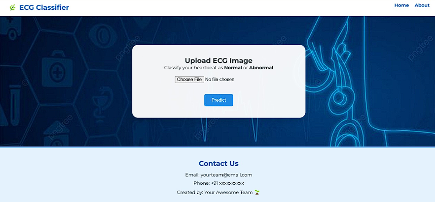
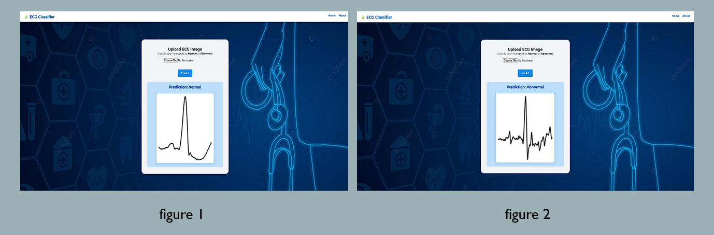
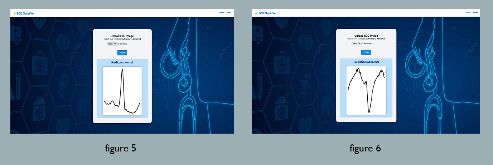

# 🫀 ECG_HeartVision — ECG Heartbeat Classifier

**ECG_HeartVision** is a medical-grade deep‑learning project that uses **VGG16** to classify **ECG heartbeats** into **Normal** or **Abnormal** categories.

---

## 🧩 Project Overview

- **Purpose**: Automate the detection of abnormal ECG heartbeat patterns via deep learning applied to ECG‑derived images.
- **Dataset**: MIT‑BIH Arrhythmia Database (preprocessed into 2D image format).
- **Model Architecture**: Fine‑tuned **VGG16** for binary ECG classification.
- **Outputs**:
  - **Classification**: Normal vs Abnormal
  - **Visual Insights**: Confusion matrix, training/validation graphs, and sample predictions
  :contentReference[oaicite:1]{index=1}

---

## 🚀 Features

- ✅ Convert ECG signals to 2D images compatible with transfer-learning workflows  
- ✅ Leverage pre-trained VGG16 fine-tuned on your ECG dataset  
- ✅ Easy-to-use **Flask** UI to upload ECGs and show instant predictions  
- 📊 Visualize: Model metrics, graphs, and performance plots  
- 🔧 Designed for extendability: Add more classes, swap models, or deploy in the cloud  

---

## ⚙️ Installation & Setup

git clone https://github.com/DYUTIMAN03/ECG_HeartVision.git
cd ECG_HeartVision
pip install -r requirements.txt

---

## 🚦 **Workflow**

**1. Preprocessing**  
Convert raw MIT‑BIH ECG signals into images using `ecg_to_image.py`.

**2. Training**  
Train or fine-tune VGG16 via `train_model.py`.

**3. Validation & Visualization**  
Observe accuracy/loss curves and confusion matrix with `visualize.py`.

**4. Prediction**  
Upload new ECG images using the Flask web UI (`app.py`) and receive instant classification results.

---

## 📸 **UI Snapshots**

### 🔹 1. Analysis Pipeline

### 🔹 2. Comment Input Interface

### 🔹 3. Processed Comments View

---

## 🛠 **Future Improvements**

- 📌 Support **multi-class classification** (e.g. arrhythmia subtypes)  
- ⚡ Integrate **modern architectures** (e.g. Vision Transformers, EfficientNet)  
- ☁️ Deploy using cloud services like **Render**, **Heroku**, or **AWS**  
- 🧠 Extend support to **12‑lead ECG** analysis and **real‑time signal capture**

---

## 📝 **Sample Results**

- ⚙️ **Training vs Validation Loss & Accuracy** plots  
- 📈 **Confusion Matrix** showing model precision  
- 🖼️ **Sample ECG input images** with their predicted labels

---

## 🧪 **How to Run Locally**

**Launch training:**
python train_model.py

**Start the Flask UI:**
python app.py

---

📚 **References and Acknowledgements**

🧾 Dataset: MIT‑BIH Arrhythmia Database

🧠 Model: Pre-trained VGG16 fine-tuned on ECG images

🧰 Tools: TensorFlow / Keras, Flask, NumPy, Matplotlib

---

🙌 **Credits**
Built with ❤️ by Dyutiman Bharadwaj

Originally developed under the repository vgg16-medical-imaging, later renamed to ECG_HeartVision for clarity and purpose.

